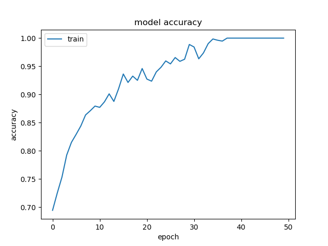
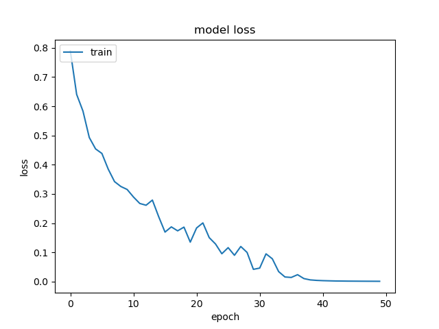

# Dementia AI Classification

Copyright © 2024 RandomKiddo, Nishanth-Kunchala, Jacoube, danield33

___

### Motivation

We wanted to create a classification model that would be able to detect if a patient has dementia based on a set of 61 layers of an MRI scan. If successful, this model could be a support tool for doctors to detect if a patient has dementia. It may not be the definitive way to detect if a patient has dementia, but it could be helpful for doctors to see what the model thinks the patient has and with what confidence.

___

### Data

The data comes from the OASIS Alzheimer's dataset, a public dataset consisting of 80,000 MRI images. Since 61 MRI images are for a single patient, it means we have over 1300 patients worth of data in this dataset. The data was downloaded from [Kaggle](https://www.kaggle.com/datasets/ninadaithal/imagesoasis), but can also be accessed through the [OASIS website](https://sites.wustl.edu/oasisbrains/).

___

### The HackAI 2024 Model

As a part of the OSU AI Club Hack AI 2024, this project was selected by the team to try in complete in the 24-hour hackathon. We downsized the OASIS images and converted them to grayscale to decrease training time and complexity. We stacked each of the 61 MRI images per patient into a 3D tensor as a numpy `ndarray` and saved the patient's 3D MRI scan as an `.npz` file. We then amplified some of the moderate dementia and mild dementia samples through duplication, as there weren't many patients with that classification. We then created a Tensorflow functional model to train on the sample data. 

Although we had a good training accuracy, we had a relatively low testing accuracy (indicating overfitting). Unfortunately, due to not having access to a GPU at the hackathon, we could not GPU accelerate the model, and we did not have enough time to test a simpler model. The training accuracy was in the high 90% range, but the testing accuracy hovered around high 70%. 

Although this repository is being integrated with the Hack AI 2024 repository (meaning the files here will now also be there), the older version of the model can still be found by looking back in the commits [here](https://github.com/Nishanth-Kunchala/Hack_AI_2024).

___

### This Model & Results

We revisited this model to try and create a better model. We continued to use the stacked 3D tensors. The creation file for them is located in the `npz_generation.py` file. 

We created a simpler Tensorflow functional model and GPU accelerated with an NVIDIA RTX 3060 to decrease training time. We added training callbacks of `ModelCheckpoint` and `EarlyStopping` to save the best possible model. We got a training accuracy of 100% (it isn't really 100%, it is being rounded) with a testing accuracy of 97.31%, indicating that our model makes much better generalizations this time around.

The model we used was the following:

Model: "model" 
\_\_\_\_\_\_\_\_\_\_\_\_\_\_\_\_\_\_\_\_\_\_\_\_\_\_\_\_\_\_\_\_\_\_\_\_\_\_\_\_\_\_\_\_\_\_\_\_\_\_\_\_\_\_\_\_\_\_\_\_\_\_\_\_\_ 
 Layer (type)                Output Shape              Param #    
\=\=\=\=\=\=\=\=\=\=\=\=\=\=\=\=\=\=\=\=\=\=\=\=\=\=\=\=\=\=\=\=\=\=\=\=\=\=\=\=\=\=\=\=\=\=\=\=\=\=\=\=\=\=\=\=\=\=\=\=\=\=\=\=\= 
 input_1 (InputLayer)        [(None, 62, 124, 61, 1)]  0          
                                                                 
 conv3d (Conv3D)             (None, 60, 122, 59, 16)   448        
                                                                 
 max_pooling3d (MaxPooling3D  (None, 30, 61, 29, 16)   0          
 )                                                               
                                                                 
 batch_normalization (BatchN  (None, 30, 61, 29, 16)   64         
 ormalization)                                                   
                                                                 
 conv3d_1 (Conv3D)           (None, 28, 59, 27, 32)    13856      
                                                                 
 max_pooling3d_1 (MaxPooling  (None, 14, 29, 13, 32)   0          
 3D)                                                             
                                                                 
 batch_normalization_1 (Batc  (None, 14, 29, 13, 32)   128        
 hNormalization)                                                 
                                                                 
 global_average_pooling3d (G  (None, 32)               0          
 lobalAveragePooling3D)                                          
                                                                 
 dense (Dense)               (None, 64)                2112       
                                                                 
 dense_1 (Dense)             (None, 4)                 260        
                                                                 
\=\=\=\=\=\=\=\=\=\=\=\=\=\=\=\=\=\=\=\=\=\=\=\=\=\=\=\=\=\=\=\=\=\=\=\=\=\=\=\=\=\=\=\=\=\=\=\=\=\=\=\=\=\=\=\=\=\=\=\=\=\=\=\=\= 
Total params: 16,868 
Trainable params: 16,772 
Non-trainable params: 96 
\_\_\_\_\_\_\_\_\_\_\_\_\_\_\_\_\_\_\_\_\_\_\_\_\_\_\_\_\_\_\_\_\_\_\_\_\_\_\_\_\_\_\_\_\_\_\_\_\_\_\_\_\_\_\_\_\_\_\_\_\_\_\_\_\_ 

Loss and accuracy graphs:

___

[Back to Top](#dementia-ai-classification)

This page was last edited on 09.28.2024